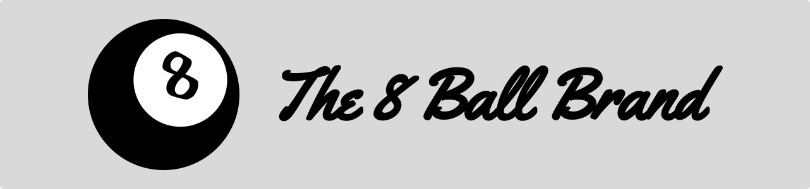

# 🎱 The 8 Ball Brand

<p align="center">
  
</p>

## 📜 Credits

| Avatar                                                                       | Name           | GitHub                                       | LinkedIn                                                    |
| ---------------------------------------------------------------------------- | -------------- | -------------------------------------------- | ----------------------------------------------------------- |
|  | Diego Sánchez  | [@CuB1z](https://github.com/CuB1z)           | [Diego Sánchez](https://www.linkedin.com/in/cub1z/)         |
|   | Jaime Portillo | [@PortiESP](https://github.com/PortiESP)     | [Jaime Portillo](https://www.linkedin.com/in/porti/)        |
|  | Daniel Santos  | [@danisntoss](https://github.com/danisntoss) | [Daniel Santos ](https://www.linkedin.com/in/danisntoss/) |

## 📂 Repository

You can find our project repository [here](https://github.com/PortiESP/ProyectoWebURJC).

## 🚀 Getting Started

Follow these steps to get the application up and running:

1. 🖥️ **Open your terminal**
2. 📁 **Navigate to the project directory**
3. 📥 **Install the dependencies** by running the following command: 

    ```bash
    npm install
    ```

4. 🚀 **Start the application** by running the following command: 

    ```bash
    npm run start
    ```

5. 🌐 **Open your browser** and go to `http://localhost:3000/`
   

## 📝 Developer Notes

- 🎯 **Main Page Searches:** If you search from the main page, the results will appear on the same page.
- 🌐 **Other Page Searches:** If you search from any other page, the results will appear on a separate search page.
- 💡 **Why a Search Bar on the Main Page?** The search bar working doesn't make sense on the main page, but it was required by the project's specifications.

---

## 📜 License

The 8 Ball Brand (c) by Diego Sánchez, Jaime Portillo, Daniel Santos

The 8 Ball Brand is licensed under a
Creative Commons Attribution 4.0 International License.

You should have received a copy of the license along with this
work. If not, see <https://creativecommons.org/licenses/by/4.0/>.
